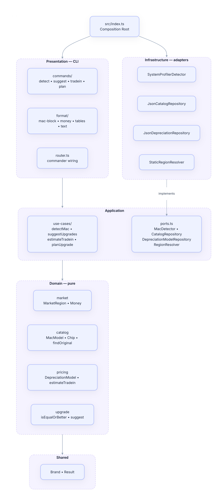
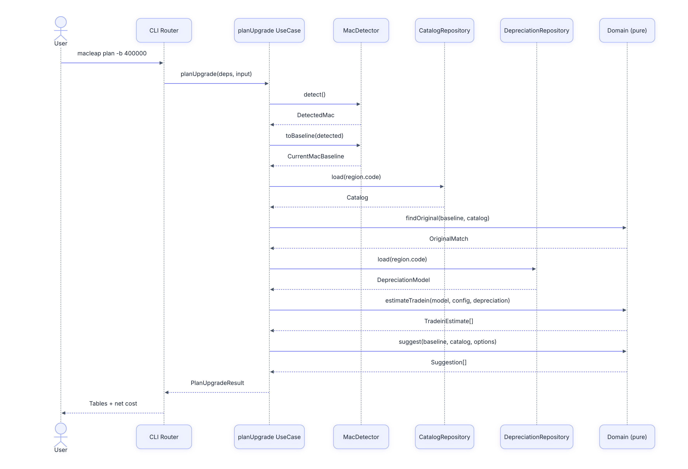

# Architecture

`macleap` follows a hexagonal (ports-and-adapters) layout. Layer boundaries are
machine-enforced by [`dependency-cruiser`](../.dependency-cruiser.cjs).



```
src/
├── shared/         # brand types, Result — zero deps
├── domain/         # pure business logic
│   ├── market/     # MarketRegion, Money (currency-aware), CurrencyCode
│   ├── catalog/    # MacModel, ChipSpec, Family, CurrentMacBaseline, findOriginal
│   ├── pricing/    # DepreciationModel, estimateTradein
│   └── upgrade/    # isEqualOrBetter, upgradeScore, suggest
├── application/    # use cases + ports
│   ├── ports.ts    # MacDetector, CatalogRepository, DepreciationModelRepository, RegionResolver
│   └── use-cases/  # detectMac, suggestUpgrades, estimateTradein, planUpgrade
├── infrastructure/ # adapters implementing ports
│   ├── detection/  # SystemProfilerDetector (macOS system_profiler)
│   ├── catalog/    # JsonCatalogRepository (loads data/regions/<code>/*.json)
│   ├── pricing/    # JsonDepreciationRepository
│   └── region/     # StaticRegionResolver
├── presentation/   # CLI surface
│   └── cli/
│       ├── commands/   # detect, suggest, tradein, plan
│       ├── format/     # mac-block, money, tables, text
│       ├── parse.ts    # flag parsing
│       ├── spinner.ts  # yocto-spinner wrapper
│       ├── deps.ts     # Deps interface (DI surface)
│       └── router.ts   # commander wiring
└── index.ts        # composition root: builds Deps from concrete adapters
```

## Layer rules

| From layer       | May import                            | May NOT import                          |
|------------------|---------------------------------------|-----------------------------------------|
| `shared`         | (nothing else in src)                 | anything in src/                        |
| `domain`         | `shared`                              | application, infrastructure, presentation |
| `application`    | `shared`, `domain`                    | infrastructure, presentation            |
| `infrastructure` | `shared`, `domain`, `application`     | presentation                            |
| `presentation`   | `shared`, `domain`, `application`     | infrastructure                          |
| `index.ts` (root)| anything                              | —                                       |

`presentation` depends on the **`Deps` interface**, not concrete adapters. The composition
root in `src/index.ts` is the only place that knows about `SystemProfilerDetector`,
`JsonCatalogRepository`, etc. This makes adapters swappable for tests or alternate
backends.

Run `npm run lint:arch` to verify.

## Plan command flow

How `macleap plan` orchestrates detection, catalog/depreciation lookup, and the
domain-only scoring step:



## Multi-region support

The codebase is region-parameterized from the ground up:

- `domain/market/region.ts` declares `MarketRegion` (code, label, default currency, newsroom feed)
- `Money` is `(amount, currency)` — addition across currencies throws
- `CatalogRepository.load(region)` and `DepreciationModelRepository.load(region)` are region-keyed
- Data lives at `data/regions/<region-code>/{lineup,historical,tradein-model}.json`
- CLI accepts `--region <code>` (default `jp`)

To add a new region:

1. Append to `SUPPORTED_REGIONS` in `src/domain/market/region.ts`
2. Add `data/regions/<code>/lineup.json`, `historical.json`, `tradein-model.json`
3. Update prices in the new region's currency (`priceUSD`, `priceEUR`, etc. — the JSON repository picks the right field per region's `currency`)
4. Calibrate `tradein-model.json` against local trade-in market data

No domain or use-case code needs to change.

## Testing

- Unit tests: colocated `*.test.ts` next to source files, run with **Vitest** (`npm test`)
- Coverage targets: `src/domain/**` and `src/application/**` (pure logic)
- Infrastructure and presentation are exercised via end-to-end CLI smoke tests

## CI / lint

- `npm run typecheck` — `tsc --noEmit`
- `npm test` — Vitest
- `npm run lint:arch` — dependency-cruiser layer enforcement
- `npm run check-lineup` — Apple Newsroom scan (CI runs weekly via GitHub Actions)
